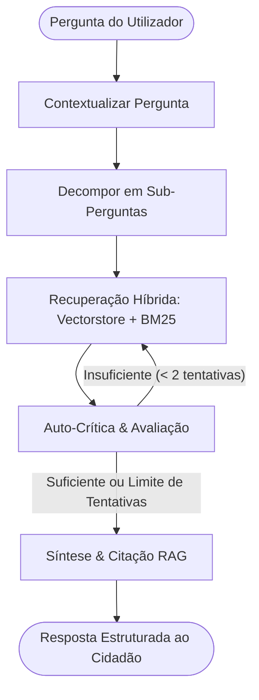

# Legal AI — Agente Jurídico Laboral & Constitucional para Angola

*Projeto desenvolvido no âmbito do Challenge Individual de Inteligência Artificial do **ONE (Oracle Next Education)** em parceria com a **Alura**.*

---

##  Sumário
- [Descrição Geral](#-descrição-geral)
- [Arquitetura da Solução (Agentic RAG)](#-arquitetura-da-solução-agentic-rag)
- [Tecnologias e Ferramentas](#-tecnologias-e-ferramentas)
- [Estrutura do Repositório](#-estrutura-do-repositório)
- [Processamento dos Documentos](#-processamento-dos-documentos)
- [Instruções de Execução](#-instruções-de-execução)
  - [Pré-requisitos](#pré-requisitos)
  - [Configuração do Backend](#1-configuração-do-backend-fastapi)
  - [Configuração do Frontend](#2-configuração-do-frontend-react--vite)
- [Exemplos de Perguntas](#-exemplos-de-perguntas)
- [Exemplo de Resposta Gerada](#-exemplo-de-resposta-gerada)
- [Deploy na Nuvem (Oracle Cloud Infrastructure - OCI)](#-deploy-na-nuvem-oracle-cloud-infrastructure---oci)
- [Aviso Legal (Disclaimer)](#-aviso-legal-disclaimer)

---

##  Descrição Geral

Segundo dados do Instituto Nacional de Estatística de Angola (INE), cerca de 78% a 80% dos trabalhadores no país atuam no setor informal ou na fronteira com a informalidade. A **Lei Geral do Trabalho (Lei n.º 12/23)**, aprovada em Dezembro de 2023, trouxe mudanças substanciais às relações laborais, mas permanece pouco compreendida pela maioria da população. Somado a isso, o custo elevado de consultoria jurídica tradicional dificulta o acesso dos cidadãos ao conhecimento de seus direitos e garantias fundamentais previstos na **Constituição da República de Angola (CRA)**.

O **Legal AI (Kamba da Lei)** é um agente inteligente conversacional construído com arquitetura **Agentic RAG (Retrieval-Augmented Generation)**. Ele permite que qualquer cidadão descreva a sua situação laboral ou dúvida jurídica em linguagem natural e receba uma orientação fundamentada, com citação expressa dos artigos vigentes da legislação angolana.

---

##  Arquitetura da Solução (Agentic RAG)

O sistema utiliza um grafo de decisão orquestrado com **LangGraph**, que implementa auto-reflexão, decomposição de consultas complexas e recuperação híbrida:



### Componentes do Grafo:
1. **`contextualizar`**: Incorpora o histórico conversacional da sessão para tornar a pergunta autônoma.
2. **`decompor`**: Quebra perguntas abrangentes em termos de busca específicos para aumentar a cobertura jurídica.
3. **`recuperar`**: Executa busca híbrida combinando:
   - **Busca Semântica Densa**: Vetorização dos artigos com `intfloat/multilingual-e5-large` no **ChromaDB**.
   - **Busca Lexical Esparsa**: Algoritmo **Rank-BM25** para correspondência exata de termos legais, números de artigos e epígrafes.
4. **`auto_criticar`**: Avalia com modelo LLM estruturado se os trechos recuperados respondem de forma suficiente e precisa à dúvida. Se necessário, reformula a busca.
5. **`sintetizar`**: Consolida a fundamentação jurídica estritamente baseada nos artigos recuperados, gerando a resposta final sem alucinações.

---

##  Tecnologias e Ferramentas

### Backend & Inteligência Artificial
- **Linguagem**: Python 3.11+
- **Framework API**: FastAPI & Uvicorn (Endpoints assíncronos)
- **Orquestração de Agente**: LangGraph & LangChain Core
- **LLM de Síntese & Citação**: Cohere (`command-r-plus-08-2024`)
- **LLM Estruturado & Ferramentas**: Groq (`openai/gpt-oss-120b` / Llama Tool-Use)
- **Embeddings**: HuggingFace Inference API (`intfloat/multilingual-e5-large`)
- **Vector Database**: ChromaDB (armazenamento persistente de vetores)
- **Busca Lexical**: Rank-BM25
- **Extração & Parser de PDF**: PyMuPDF (`fitz`) com chunking semântico por artigo

### Frontend & Interface
- **Framework**: React 19 com Vite
- **Estilização & Componentes**: Chakra UI v3 & Emotion
- **Roteamento**: React Router DOM v7
- **Ícones**: React Icons (Material Design)
- **Design System**: Tipografia moderna (Montserrat & JetBrains Mono) com identidade visual inspirada nos tons nacionais de Angola (Padrão Samakaka).

---

## Estrutura do Repositório

```text
legal-ai-assistant/
├── backend/
│   ├── app/
│   │   ├── agent/
│   │   │   ├── conversation.py         # Formatação de histórico conversacional
│   │   │   ├── detect_and_recover.py   # Recuperação híbrida (BM25 + ChromaDB)
│   │   │   ├── embedding.py            # Indexação e modelo de embeddings
│   │   │   ├── exact_recovery.py       # Extração e busca direta por número de artigo
│   │   │   ├── llm_providers.py        # Configuração de clientes LLM (Cohere, Groq)
│   │   │   ├── supervisor.py           # Definição e compilação do grafo LangGraph
│   │   │   └── text_extraction.py      # Extração e chunking semântico dos PDFs
│   │   ├── api/
│   │   │   └── chat_router.py          # Endpoint POST /v1/chat com suporte a sessão
│   │   ├── models/
│   │   │   ├── agent.py                # TypedDict de Estado do Agente
│   │   │   ├── assessment_recovery.py  # Nós de auto-crítica e síntese
│   │   │   └── context.py              # Nós de contextualização e decomposição
│   │   └── config.py                   # Carregamento de variáveis de ambiente
│   ├── chroma_legal_ai/                # Base vetorial persistente do ChromaDB
│   ├── main.py                         # Ponto de entrada da aplicação FastAPI
│   ├── requirements.txt                # Dependências Python
│   ├── .env.example                    # Modelo de variáveis de ambiente do backend
│   └── README.md
├── frontend/
│   └── legal-ai-front/
│       ├── src/
│       │   ├── components/
│       │   │   ├── ChatInput.jsx        # Caixa de mensagem adaptativa
│       │   │   ├── Header.jsx           # Barra de navegação responsiva
│       │   │   ├── Footer.jsx           # Rodapé institucional
│       │   │   ├── MarkdownRenderer.jsx # Renderizador de seções e citações jurídicas
│       │   │   └── PdfDownloadModal.jsx # Modal para consulta dos PDFs oficiais
│       │   ├── pages/
│       │   │   ├── HomePage.jsx         # Página inicial e consulta rápida
│       │   │   ├── ChatPage.jsx         # Interface de conversação multi-turn
│       │   │   └── AboutPage.jsx        # Explicação do projeto e metodologia RAG
│       │   ├── services/
│       │   │   └── api.js               # Cliente HTTP para comunicação com o backend
│       │   ├── App.jsx
│       │   └── main.jsx
│       ├── package.json
│       └── .env.example
└── README.md
```

---

##  Processamento dos Documentos

O pipeline processa diretamente os documentos oficiais em formato PDF via URL:

| Diploma Legal | Fonte Oficial | Estratégia de Processamento |
| :--- | :--- | :--- |
| **Constituição da República de Angola (CRA)** | [CIPRA Gov Angola](https://plataformacipra.gov.ao/public/ficheiros/arquivos/Gov_AngolaConstitui%C3%A7%C3%A3o190102230948141675284494.pdf) | Extração com PyMuPDF, remoção de cabeçalhos do Diário da República, chunking semântico artigo por artigo. |
| **Lei Geral do Trabalho (Lei n.º 12/23)** | [INEJ](https://inej.ao/wp-content/uploads/2025/12/LEI-GERAL-DO-TRABALHO.pdf) | Limpeza de notas de rodapé, extração de epígrafes, datas de vigência e metadados estruturados por artigo. |

---

##  Instruções de Execução

### Pré-requisitos
- **Python 3.11+**
- **Node.js 18+** e **npm**
- Chaves de API válidas:
  - [Groq Cloud](https://console.groq.com/)
  - [Cohere AI](https://cohere.com/)
  - [Hugging Face Hub](https://huggingface.co/)

---

### 1. Configuração do Backend (FastAPI)

1. Aceda à pasta do backend:
   ```bash
   cd backend
   ```

2. Crie e ative um ambiente virtual:
   ```bash
   python3 -m venv .venv
   source .venv/bin/activate  # No Windows: .venv\Scripts\activate
   ```

3. Instale as dependências:
   ```bash
   pip install -r requirements.txt
   ```

4. Configure as variáveis de ambiente criando o ficheiro `.env` a partir do `.env.example`:
   ```bash
   cp .env.example .env
   ```
   Preencha com as suas chaves no ficheiro `.env`:
   ```env
   HUGGINGFACEHUB_API_TOKEN=sua_chave_huggingface
   EMBED_TOKEN=sua_chave_huggingface
   GROQ_API_KEY=sua_chave_groq
   COHERE_API_KEY=sua_chave_cohere
   CHROMA_PERSIST_DIR=./chroma_legal_ai
   CHROMA_COLLECTION=legislacao_angola
   ```

5. Inicie o servidor FastAPI:
   ```bash
   uvicorn main:app --reload --port 8000
   ```
   *A API estará disponível em `http://localhost:8000` (documentação interativa em `http://localhost:8000/docs`).*

---

### 2. Configuração do Frontend (React + Vite)

1. Em outro terminal, aceda à pasta do frontend:
   ```bash
   cd frontend/legal-ai-front
   ```

2. Instale as dependências:
   ```bash
   npm install
   ```

3. Configure as variáveis de ambiente:
   ```bash
   cp .env.example .env
   ```
   *(Certifique-se de que `VITE_API_URL=http://localhost:8000` está configurado).*

4. Inicie o servidor de desenvolvimento:
   ```bash
   npm run dev
   ```
   *A aplicação estará acessível em `http://localhost:5173`.*

---

##  Exemplos de Perguntas

O agente está preparado para esclarecer situações reais do cotidiano laboral angolano:

1. **Período Experimental:**
   > *"Fui contratado há 40 dias sem contrato escrito e disseram-me que ainda estou à experiência. O empregador pode despedir-me sem justificação?"*
2. **Despedimento e Justa Causa:**
   > *"Quais são os procedimentos obrigatórios que a empresa deve cumprir antes de aplicar um despedimento por justa causa?"*
3. **Férias e Remuneração:**
   > *"Quantos dias de férias tenho direito após completar um ano de trabalho e quando deve ser pago o subsídio de férias?"*
4. **Horas Extraordinárias:**
   > *"Qual é o limite legal de trabalho suplementar por semana e como deve ser remunerado?"*
5. **Garantias Constitucionais:**
   > *"O que a Constituição de Angola garante em relação à liberdade sindical e ao direito à greve?"*
6. **Despedimento e Justa Causa:**
   > *"Fui despedida três semanas depois de voltar da licença de maternidade."*

---

##  Exemplo de Resposta Gerada

Quando questionado sobre o funcionamento do período experimental na LGT, o agente responde de forma estruturada:

```markdown
## Resposta
Nos termos da Lei Geral do Trabalho de Angola (Lei n.º 12/23), o período experimental corresponde ao tempo inicial de execução do contrato de trabalho, destinando-se à comprovação da aptidão do trabalhador e do interesse do empregador. 

Para contratos por tempo indeterminado, a duração padrão é de 60 dias para a generalidade dos trabalhadores, podendo estender-se até 180 dias para cargos de elevada complexidade técnica ou de direção. Durante este período, salvo acordo escrito em contrário, qualquer das partes pode rescindir o contrato sem necessidade de pré-aviso nem direito a indemnização.

## Fontes utilizadas
- **Lei Geral do Trabalho (Lei n.º 12/23), Artigo 45.º — Noção e Duração do Período Experimental** (vigente desde 2024)
- **Lei Geral do Trabalho (Lei n.º 12/23), Artigo 46.º — Redução e Exclusão do Período Experimental** (vigente desde 2024)
- **Constituição da República de Angola (CRA), Artigo 76.º — Trabalho e Direitos dos Trabalhadores** (revisão 2021)

## Recomendação
Verifique a cláusula de período experimental expressa no seu contrato de trabalho. Caso o prazo fixado na lei já tenha sido ultrapassado, a rescisão unilateral sem justa causa passa a conferir direito à devida indemnização por despedimento.
```

---

##  Deploy na Nuvem (Oracle Cloud Infrastructure - OCI)

A aplicação foi projetada para execução em nuvem na **Oracle Cloud Infrastructure (OCI)**:
- **Backend**: Containerizado em instância Compute VM (Ubuntu) na OCI, executando FastAPI via Uvicorn.
- **Frontend**: Hospedado como build estática no surge.sh.

> **Status do Deploy:** Em processo / publicação no ambiente cloud.

---

##  Aviso Legal (Disclaimer)

O **Legal AI (Kamba da Lei)** é um assistente de inteligência artificial de cariz meramente **informativo e educacional**. As respostas produzidas não constituem parecer jurídico vinculativo nem substituem a consulta formal com um **Advogado ou Jurista** inscrito na **Ordem dos Advogados de Angola (OAA)** ou junto dos serviços da **Inspeção Geral do Trabalho (IGT)**.

---

## Autor & Contactos

Desenvolvido por **Frederico Macau**:
- **GitHub:** [@fredhmacau](https://github.com/fredhmacau)
- **LinkedIn:** [Frederico Macau](www.linkedin.com/in/frederico-macau-195167273)
- **Repositório do Projeto:** [legal-ai-assistant](https://github.com/fredhmacau/legal-ai-assistant)